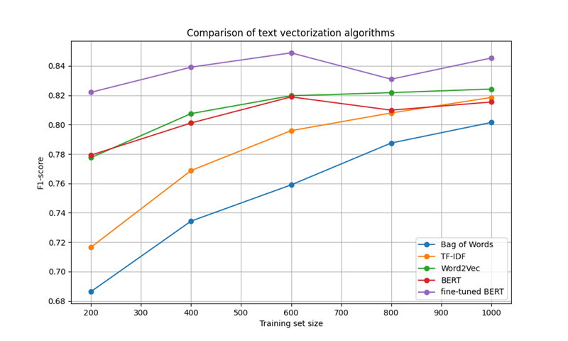
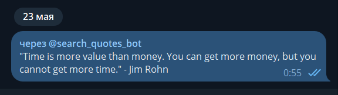

# text-embeddings-diplom

This is the repository of my thesis on the topic "Methods of vectorization of words when processing text data".

The thesis presents a comprehensive study of word vectorization methods from classical statistical approaches 
(Bag of Words, TF-IDF) to modern neural network architectures (Word2Vec, BERT). The advantage of the pre-trained BERT 
model for critical applications, the optimality of Word2Vec for real-time systems, and the relevance of TF-IDF for 
resource-constrained environments have been experimentally confirmed. A Telegram bot for semantic citation search has 
been developed and implemented, demonstrating high quality results with adequate response time.

The code consists of three main scripts:
* main_train.py - Fine-tuning the BERT model on a dataset of famous people's quotes
* main_compare.py - Comparative analysis of various vectorization methods with graph construction
* main_bot.py - Launching a Telegram bot to search for quotes

### Demonstration

Dependence of F1 score on the size of the training sample for different vectorization methods:

Example of using a Telegram bot:

### Used technology

* Python 3.12
* Aiogram 3.x (Telegram Bot framework)
* SQLAlchemy 2.x (ORM)
* Datasets (HuggingFace community-driven open-source library of datasets)
* TensorBoard (Machine learning visualization)
* Scikit-learn (Open-source machine learning library)
* Matplotlib (Graph visualization)
* Transformers (Open-source toolkit used to download, train, and run state-of-the-art machine learning models)
* Gensim (Used for the Word2Vec model)

### Installation

* Edit file `example.env` and fill it with your data, then rename it to `.env`
* Install dependencies:  
`pip install -r requirements.txt`
* Run one of the scripts:  
`python main_train.py`  
`python main_compare.py`  
`python main_bot.py`  